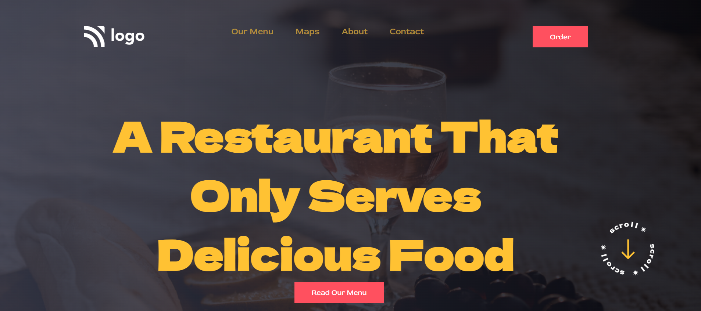

# Live Class Project-2

Project- Restaurant | Landing Page

This assignment was given as task in ineuron's FSJSBootCamp Course.

Technologies/ Tools Used:

- HTML
- CSS
- GitHub

       

Click on the below given link to get the preview of the page

&nbsp;

Learnings from this projects:-
* How to use different positions in css.
* Different CSS properties.

## Time Taken to complete this project was 2 days.
